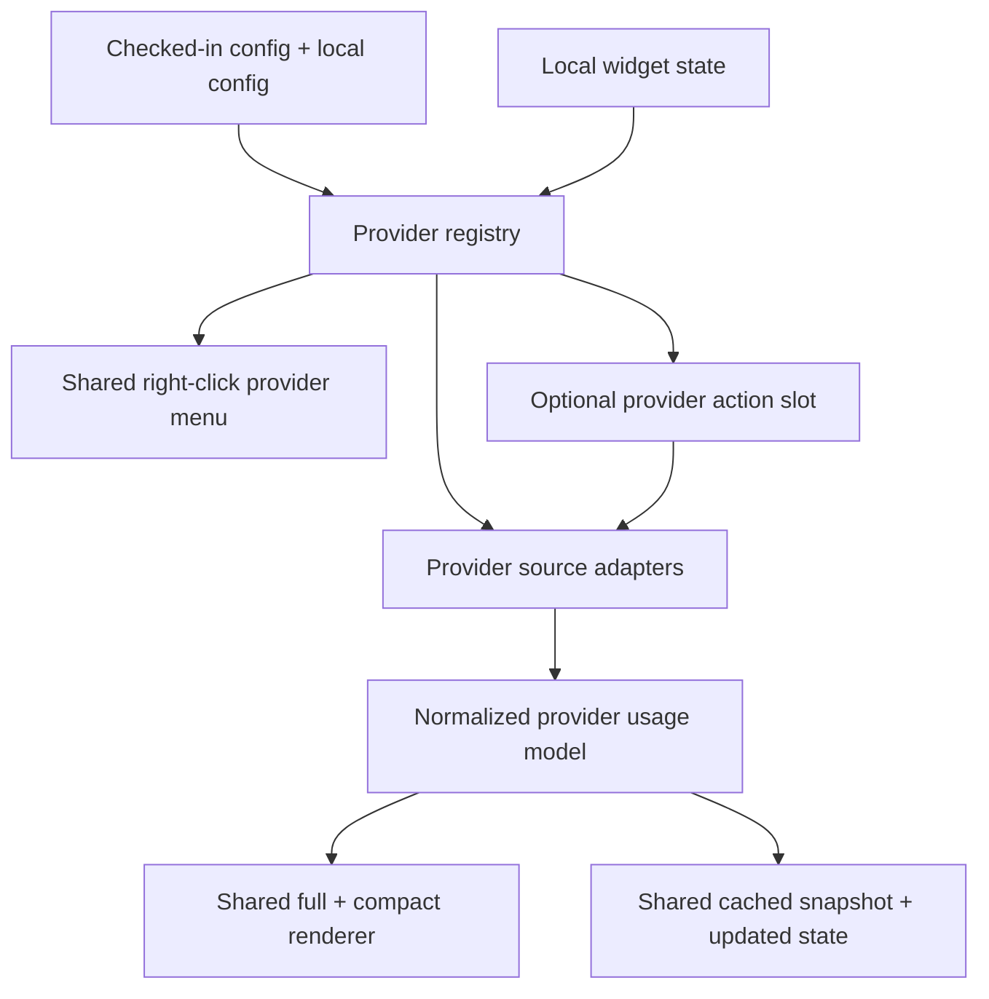
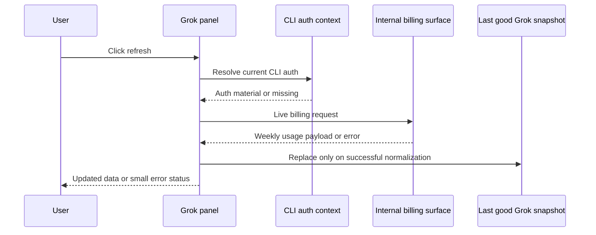

# Grok Provider Limits and Reusable Provider Framework - Plan

## Goal Capsule

- **Objective:** Add Grok subscription limits to the widget with a safe default local source, a manual "check via API" refresh path, and a reusable provider architecture that keeps Claude as the next provider add rather than the next large refactor.
- **User-visible outcome:** Users can enable or disable providers from config, show or hide enabled providers from the widget's right-click menu, and see Grok weekly usage with a small manual refresh control.
- **Authority hierarchy:** Follow the confirmed scope from this chat first, then existing widget behavior and repo conventions, then Grok and xAI surfaces as they exist on July 5, 2026.
- **Constraints:** Preserve tray-first behavior, do not persist Grok auth secrets in repo config or local widget state, do not fake a Grok session window that does not exist, and avoid regressions for existing Codex and MiniMax users.
- **Stop conditions:** The feature is done when Codex, MiniMax, and Grok all run through one shared provider contract, Grok works from local logs by default, manual refresh is best-effort and safe, and docs plus regression coverage are updated.

---

## Product Contract

### Summary

This plan adds Grok as an optional provider in the existing widget, using local Grok billing logs as the default data source and a manual live refresh through the currently installed CLI auth as a supplemental action.
It also replaces the current two-provider hardcoding with a reusable provider contract for config, state, rendering, refresh capabilities, and right-click visibility so Claude can be added next without duplicating the same refactor.

### Problem Frame

The widget currently assumes exactly two providers almost everywhere: config merge rules, saved state, full and compact layout, context menu entries, cached snapshots, and data application.
That works for Codex and MiniMax, but it makes every new provider a copy-and-edit exercise across unrelated UI and state code.

Grok's subscription surface also differs from the current two providers.
As of the June 2026 Grok subscription rollout, paid Grok usage is a single shared weekly pool across products, shown as percentage used with a weekly reset, rather than a session-plus-weekly pair.
The installed Grok CLI exposes `/usage` inside the interactive TUI, but its documented CLI subcommands do not provide a scriptable public usage command, and xAI's public API rate-limit docs describe API-team RPS and TPM rather than consumer subscription usage.
Local CLI activity already writes billing snapshots that contain the weekly percent and reset window, which makes a no-secret default possible, but that local data can go stale if the CLI has not refreshed recently.

### Requirements

#### Provider Framework

- R1. The widget must use a shared provider contract for provider metadata, enabled state, visible state, fetch capabilities, and rendering so that adding Grok now and Claude later does not require provider-specific UI duplication.
- R2. The shared usage model must support one or more limit windows per provider instead of assuming a fixed `primary` plus `secondary` pair.
- R3. Existing Codex and MiniMax behavior must remain available after the refactor, including tray-first behavior, compact mode, refresh cadence, last-activity hints, and current data sources.

#### Grok Data and Refresh

- R4. Grok must work by default from local CLI-written billing data and must not require storing auth material in checked-in config, ignored local config, or widget state.
- R5. Grok must display its real weekly usage percentage, weekly reset time, freshness or staleness, and available plan or tier metadata when present.
- R6. Grok must provide a manual refresh action that attempts a live billing fetch through the currently installed CLI auth context, updates the displayed data when successful, and does not replace the last good local snapshot with an empty or failed result.
- R7. The manual refresh path must be best-effort only: no background polling of undocumented internal endpoints, no VPS dependency in v1, and no secret persistence beyond whatever the CLI already manages locally.

#### Configuration and Interaction

- R8. Checked-in config and ignored local config must support enabling or disabling providers independently and carrying provider-specific settings without hardcoded one-off merge logic for only MiniMax.
- R9. The widget's right-click menu must let the user show or hide enabled providers and must prevent hiding the last visible provider.
- R10. Full and compact layouts must adapt cleanly to one, two, or three visible providers without clipping, and the manual refresh affordance must be added through a reusable action slot rather than a Grok-only branch in shared rendering.

#### Documentation and Quality

- R11. Repo docs and sample config must explain that Grok defaults to local CLI billing data, that manual refresh uses an undocumented internal surface and may fail, and that provider enablement and visibility are separate controls.
- R12. Feature-bearing changes must include tests for provider normalization, Grok parsing, manual refresh fallback behavior, provider visibility rules, and dynamic layout calculations.

### Acceptance Examples

- AE1. With Grok enabled and fresh local billing data available, the widget shows one Grok weekly limit row with the current used percentage and weekly reset timing, without inventing a session row.
- AE2. With Grok enabled but only stale local billing data available, the widget still shows the last good weekly usage snapshot and marks it stale instead of replacing it with empty placeholders.
- AE3. After the user clicks Grok's manual refresh control and the live fetch succeeds, the Grok panel updates immediately from the fresh billing response and records the new updated-at timestamp.
- AE4. After the user clicks Grok's manual refresh control and the live fetch fails because auth is missing, expired, or the internal endpoint changes, the last good Grok snapshot remains visible and a small error state appears without breaking Codex or MiniMax.
- AE5. When the user right-clicks the widget and toggles providers, the menu reflects enabled providers, updates visible providers in place, and refuses to hide the last visible provider.

### Scope Boundaries

#### Deferred to Follow-Up Work

- Claude provider implementation.
- Any provider-specific dashboard deep links beyond what already exists for Codex.
- Richer provider ordering or drag-to-reorder behavior.

#### Out of Scope

- Running a VPS daemon or background service for Grok in v1.
- Automatic polling of Grok's undocumented internal billing endpoint.
- A generic plugin loader or provider marketplace inside this app.
- A synthetic Grok "current session" bar that does not map to a real Grok subscription limit.

### Sources and Research

- Repo grounding: `usage-widget.ps1` currently hardcodes Codex and MiniMax in `Read-State`, `Read-Config`, `Build-ProviderContextMenu`, `Sync-ProviderVisibility`, `New-UsageSnapshot`, `Restore-UsageSnapshot`, `Apply-WidgetData`, and `Build-Widget`.
- Repo grounding: the current widget uses fixed provider-specific compact widths and a full-height recalculation only after visibility changes, which is why adding a third provider must include shared sizing logic instead of another branch.
- Local Grok observation on July 5, 2026: the installed CLI is `grok 0.2.82`, its help starts the TUI by default, and the local unified billing log repeatedly emits weekly `creditUsagePercent`, weekly period bounds, and tier metadata.
- xAI docs: Grok paid subscriptions now use one flexible weekly pool across products, shown as percentage used with a weekly reset in Settings → Usage, published in the Grok FAQ update from late June 2026 ([FAQ - Grok Website / Apps](https://docs.x.ai/grok/faq)).
- xAI docs: `/usage` is documented as a TUI slash command, not a top-level CLI subcommand, in the page last updated July 2, 2026 ([Modes and Commands](https://docs.x.ai/build/modes-and-commands)).
- xAI docs: the CLI Reference page published on July 5, 2026 lists subcommands such as `models`, `sessions`, and `agent`, but no public scriptable usage subcommand ([CLI Reference](https://docs.x.ai/build/cli/reference)).
- xAI docs: public xAI API rate limits are API-team RPS and TPM limits tied to spend tiers, which is a different surface from consumer Grok subscription usage ([Rate Limits](https://docs.x.ai/developers/rate-limits)).
- Local Grok binary inspection on the installed July 5, 2026 build exposes internal auth and billing strings, which is enough to justify a manual best-effort refresh path but not enough to treat it as a stable supported API surface.

---

## Planning Contract

### Key Technical Decisions

- KTD1. Introduce a small registry-driven provider contract instead of a generic plugin system.
  This keeps the codebase simple while removing the current Codex or MiniMax branching from state, menu, rendering, and snapshot logic.

- KTD2. Normalize provider usage as a provider record plus a variable-length collection of limit windows.
  Codex and MiniMax will map into two windows, while Grok maps into one weekly window, which lets Claude add whichever real windows it exposes without another model rewrite.

- KTD3. Make Grok's default source the local CLI billing log and treat the manual refresh path as supplemental.
  The log path requires no new secrets and already carries the weekly percent, reset window, and tier data; it is the safest always-on default even if it can stale.

- KTD4. Keep Grok's manual refresh user-driven and best-effort through live CLI auth, with no background polling.
  The internal billing surface is undocumented and may change, so the app should only touch it when the user explicitly clicks refresh and should preserve the last good snapshot on failure.

- KTD5. Generalize config merge, provider visibility state, and panel rendering before adding Grok-specific fetch code.
  This avoids landing Grok on top of a second layer of hardcoded Codex or MiniMax assumptions and reduces follow-up work for Claude.

- KTD6. Explicitly reject a VPS or background refresh worker for Grok v1.
  The missing stable public subscription-usage API is the real constraint, so moving the same unsupported call to another machine would add operations burden without adding reliability.

### High-Level Technical Design

### Assumptions

- The mini refresh affordance lives in the full Grok panel header; compact mode reuses shared status and tooltip surfaces instead of adding a dedicated compact button.
- The live refresh implementation may need to read auth state from the current CLI-managed local files at click time, but the exact file layout should remain an implementation detail hidden behind a Grok refresh adapter.

### System-Wide Impact

- The widget stops being a hardcoded two-provider app and becomes a small multi-provider shell with shared data, layout, and state contracts.
- Saved state and cached snapshots become more flexible, so backward compatibility for existing Codex and MiniMax users must be preserved explicitly.
- Dynamic sizing becomes more important because the app's fixed full width and compact widths were tuned around exactly two providers.

### Risks and Dependencies

- The Grok manual refresh surface is undocumented and may break when the CLI changes.
  Mitigation: keep the API path manual-only, normalize it through the same Grok adapter as the log path, and preserve the last good local snapshot on any live-refresh failure.
- Local Grok billing data can be stale if the CLI has not refreshed recently.
  Mitigation: mark freshness visibly, keep stale data readable, and avoid representing stale data as a hard failure when it is still the best known snapshot.
- The repo is already dirty in `README.md`, `usage-widget.config.json`, and `usage-widget.ps1`.
  Mitigation: implementation must isolate the provider refactor, preserve the current MiniMax-related user edits, and avoid opportunistic cleanup outside the touched scope.
- WPF layout values are tightly packed, so a third provider plus an action slot needs measured resizing rather than magic-number growth.
  Mitigation: drive sizing from visible-provider counts and measured content height instead of another fixed Codex or MiniMax branch.

### Documentation and Operational Notes

- Grok docs in this repo should explicitly say that the widget tracks the shared weekly Grok subscription pool, not Grok API rate limits.
- The manual refresh path should be documented as unsupported and best-effort so future provider work does not treat it as a stable contract to copy blindly.
- Future Claude work should reuse the shared provider registry and action slot added here rather than reintroducing provider-specific layout code.

---

## Implementation Units

### U1. Shared Provider Contract and State Migration

- **Goal:** Replace current two-provider assumptions with a shared provider registry, normalized provider state, and backward-compatible snapshot plus config handling.
- **Requirements:** R1, R2, R3, R8, R9.
- **Dependencies:** None.
- **Files:** `usage-widget.ps1`, `usage-widget.config.json`, `tests/provider-contract.Tests.ps1`, `tests/provider-state.Tests.ps1`.
- **Approach:** Introduce a provider descriptor shape that covers provider id, display label, accent, availability, visibility, optional manual action capability, and data fetch hooks. Replace hardcoded `providers.codex` and `providers.minimax` handling with provider-keyed dictionaries, and generalize local-config merging so provider-specific objects are merged consistently instead of only for MiniMax.
- **Execution note:** Add characterization coverage around current Codex and MiniMax visibility and snapshot behavior before replacing the state shape.
- **Patterns to follow:** Reuse the existing object helpers such as `Get-ObjectValue`, the current MiniMax settings normalization style, and the local state persistence flow in `Read-State` plus `Save-State`.
- **Test scenarios:**
  - Codex and MiniMax state files from the pre-Grok schema still load with both providers visible by default.
  - A config that enables Grok and disables MiniMax produces three registry entries but only enabled providers are eligible for rendering and menu toggles.
  - Provider snapshot serialization restores one-window and two-window providers without dropping updated-at or error fields.
  - Local config overrides merge into the matching provider object without erasing unrelated checked-in provider settings.
- **Verification:** Existing users can restart without deleting local state, and the app reconstructs provider enablement plus cached snapshots without schema errors.

### U2. Shared Rendering, Dynamic Layout, and Right-Click Provider Menu

- **Goal:** Render provider panels, compact tiles, and provider visibility controls from shared metadata instead of Codex or MiniMax branches.
- **Requirements:** R1, R2, R3, R9, R10.
- **Dependencies:** U1.
- **Files:** `usage-widget.ps1`, `tests/provider-layout.Tests.ps1`, `tests/provider-menu.Tests.ps1`.
- **Approach:** Build provider panels from registry metadata and normalized limit-window collections. Move right-click menu creation to a loop over enabled providers with a last-visible guard, and replace compact width and column logic with count-driven placement that supports one, two, or three visible providers. Add a reusable header action slot so Grok can surface a refresh control without special-casing the shared renderer.
- **Patterns to follow:** Keep the existing glass styling, `Get-FullWidgetHeight`, `Set-WidgetMode`, and compact-panel visual language rather than introducing a new layout system.
- **Test scenarios:**
  - One visible provider uses the single-provider compact width and a full layout with no hidden blank section spacing.
  - Two visible providers preserve current compact placement behavior.
  - Three visible providers produce a valid compact column arrangement and a full height that remains within the widget's allowed bounds.
  - Right-click toggling hides and shows enabled providers immediately but refuses to hide the last visible provider.
  - A provider with no manual action slot renders the same header spacing as current Codex and MiniMax panels.
- **Verification:** Full and compact views remain visually stable when cycling through one, two, and three visible providers, and the context menu reflects provider state correctly.

### U3. Grok Local Billing Adapter

- **Goal:** Add a Grok provider that reads and normalizes local billing snapshots into the shared provider model.
- **Requirements:** R4, R5, R8, R10, R12.
- **Dependencies:** U1, U2.
- **Files:** `usage-widget.ps1`, `usage-widget.config.json`, `tests/grok-log-parser.Tests.ps1`, `tests/grok-provider.Tests.ps1`.
- **Approach:** Parse the latest Grok billing entries from the local unified billing log, treat `creditUsagePercent` as used percent, map the weekly period bounds into the shared reset fields, and carry tier plus freshness metadata into the Grok provider state. Grok's normalized provider output should expose a single weekly limit window and a clear stale or waiting message when the log has not refreshed recently.
- **Execution note:** Start with parser and normalization fixtures before wiring the provider into the update loop.
- **Patterns to follow:** Mirror the current Codex and MiniMax normalization helpers that clamp percentages, convert timestamps, and preserve the last good snapshot through temporary data gaps.
- **Test scenarios:**
  - The newest valid billing entry wins even when malformed or unrelated log lines appear later in the file.
  - A Grok billing entry with weekly period start and end produces one weekly window with the expected reset timestamp.
  - A `creditUsagePercent` value of `100` remains `100` used rather than being inverted into remaining percent.
  - Missing or stale billing entries surface a waiting or stale state without crashing the provider loop.
  - Tier metadata such as the current subscription label is preserved for display or tooltip usage when present.
- **Verification:** With Grok enabled and local billing data available, the widget shows a valid weekly Grok panel that survives repeated refresh cycles.

### U4. Grok Manual Refresh Adapter

- **Goal:** Add a reusable manual provider action and implement Grok's live refresh path through current CLI auth.
- **Requirements:** R6, R7, R10, R11, R12.
- **Dependencies:** U1, U2, U3.
- **Files:** `usage-widget.ps1`, `README.md`, `tests/grok-refresh.Tests.ps1`.
- **Approach:** Add a provider action contract that can run on demand, report small transient status, and update the provider's last good snapshot only after successful normalization. The Grok implementation should resolve auth from the current CLI-managed local context, call the internal CLI billing surface, normalize the response through the same shared Grok shape, and never write auth material into widget config, logs, or saved state.
- **Patterns to follow:** Reuse current error-tolerant fetch style from MiniMax and existing updated-at handling rather than introducing a second status framework.
- **Test scenarios:**
  - A successful live refresh replaces stale Grok data and updates the displayed timestamp.
  - Missing auth or unreadable CLI auth state leaves the previous Grok snapshot intact and surfaces a small error message.
  - Timeout, unauthorized, or malformed-response failures preserve the last good Grok snapshot and do not affect Codex or MiniMax panels.
  - Successful or failed manual refresh attempts do not write Grok auth material into `usage-widget.state.json`, checked-in config, or ignored local config.
  - Provider actions are inert for providers that do not declare a manual refresh capability.
- **Verification:** The Grok refresh control works as a manual supplement, not as a polling source, and failures are recoverable without restarting the widget.

### U5. Integration, Docs, and Regression Coverage

- **Goal:** Finish the Grok integration path, document the new provider model, and lock in regression coverage for current providers.
- **Requirements:** R3, R8, R11, R12.
- **Dependencies:** U1, U2, U3, U4.
- **Files:** `usage-widget.ps1`, `usage-widget.config.json`, `README.md`, `tests/provider-regression.Tests.ps1`.
- **Approach:** Wire Grok into the shared provider update loop, sample config, and visibility defaults; document provider enablement versus visibility; and add regression coverage that proves Codex and MiniMax still map correctly into the new shared provider model. Keep Grok provider ordering explicit so Claude can be inserted later without redoing the renderer.
- **Patterns to follow:** Preserve the repo's current README structure and existing provider names, colors, and glass panel style.
- **Test scenarios:**
  - Existing Codex and MiniMax snapshots still render the same used percentages and reset times after the shared provider refactor.
  - A config with Grok disabled does not show Grok UI or execute Grok refresh logic.
  - A config with Grok enabled but no local Grok artifacts shows a waiting state rather than an exception.
  - The documented sample config explains enablement and provider-specific settings without requiring secrets in checked-in files.
- **Verification:** A fresh checkout can understand how to enable Grok, and current Codex plus MiniMax users keep working behavior after the refactor.

---

## Verification Contract

| Gate | Applies to | Done signal |
|---|---|---|
| `powershell -NoProfile -ExecutionPolicy Bypass -Command "Invoke-Pester -Path .\\tests -EnableExit"` | U1-U5 | Shared provider, Grok parser, refresh fallback, menu, and layout tests pass. |
| `powershell -NoProfile -ExecutionPolicy Bypass -Command "$errors = $null; $tokens = $null; [void][System.Management.Automation.Language.Parser]::ParseFile((Resolve-Path '.\\usage-widget.ps1'), [ref]$tokens, [ref]$errors); if ($errors) { $errors | ForEach-Object { $_.Message }; exit 1 }"` | U1-U5 | `usage-widget.ps1` remains syntactically valid after the refactor. |
| Manual widget launch in full and compact modes | U2-U5 | One, two, and three visible providers fit without clipping; Grok weekly-only presentation looks intentional; the right-click menu stays usable. |
| Manual Grok refresh exercise with and without valid CLI auth | U4-U5 | Success updates Grok immediately; failure preserves the last good snapshot and reports a small recoverable error. |
| Local state and config sanity check after Grok refresh | U4-U5 | Saved widget state contains display data only and no copied Grok auth material. |

---

## Definition of Done

- Grok can be enabled as a provider, reads weekly usage from local CLI billing data by default, and never invents unsupported session limits.
- The widget uses one shared provider contract for state, config, rendering, snapshots, visibility, and optional manual actions across Codex, MiniMax, and Grok.
- The Grok manual refresh path is explicit, best-effort, and secure by construction: no secret persistence, no background polling, and no destructive failure mode.
- Right-click provider visibility works for dynamic provider counts and prevents hiding the last visible provider.
- README and checked-in config explain provider enablement, Grok defaults, and the manual refresh caveat.
- Tests cover the shared provider contract, Grok parsing, manual refresh fallback, and layout plus visibility regressions.
- The implementation leaves the user's current uncommitted changes in `README.md`, `usage-widget.config.json`, and `usage-widget.ps1` intact except where the requested feature intentionally overlaps them.
