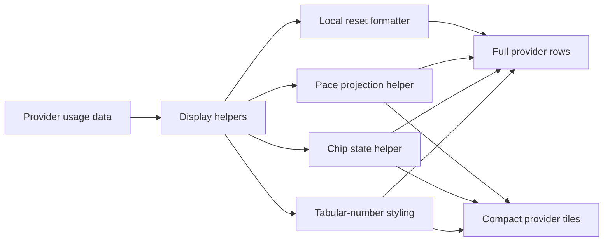

# Widget UX Clarity and Compact View Polish - Plan

## Goal Capsule

- **Objective:** Improve readability, predictability, and compact-mode density of the usage widget without changing its data sources or tray-first behavior.
- **User-visible outcome:** Reset times follow the computer's local timezone, usage rows read more clearly, pace hints become checkable projections, Grok gets the same projection treatment, compact mode becomes visually cleaner, and numeric values stop jumping during refresh.
- **Authority hierarchy:** Follow the numbered requirements from this chat first, then existing widget behavior in `usage-widget.ps1`, then current repo conventions.
- **Constraints:** Keep changes focused, preserve current provider data plumbing, avoid broad refactors, and verify that fixed widget sizing still fits after spacing changes.
- **Stop conditions:** The full widget and compact view both present stable typography, clearer hierarchy, projection-based hints, and cleaner compact grouping with no obvious clipping or regressions.

---

## Product Contract

### Summary

This work is a UI and wording polish pass over the current provider renderer, not a provider-model rewrite.
The main jobs are to replace one hardcoded timezone path, improve hierarchy between the primary and weekly rows, convert vague pace text into measurable projections, add a compact status chip model, and tighten compact-mode visuals so the tray view feels cleaner and denser.

### Problem Frame

The current widget has three usability issues that stack together:

- Some displayed facts are not trustworthy enough at a glance, especially `Reset ... Bali`, which is tied to one timezone rather than the machine that is rendering the widget.
- Several text and spacing choices compete with the actual usage signal: section titles are bright, weekly rows breathe too much, compact mode carries double borders, and numeric widths shift during live refresh.
- The current pace hint is emotionally helpful but not operationally useful.
  It tells the user to feel calm, but it does not explain what that implies by reset.

The code already has natural hook points for all of this work:
`Format-BaliReset`, `Format-LocalReset`, `Get-UsageHint`, `New-LimitRow`, `New-ProviderSection`, `New-CompactProviderPanel`, `Update-CompactProviderPanel`, and `Update-LimitRow`.
The plan should stay inside those rendering and display helpers unless a small shared formatter or status helper makes the code simpler.

### Requirements

#### Time and Number Formatting

- R1. Reset text must be computed in the computer's local timezone for every provider row; no provider may keep the Bali-specific display path.
- R1a. Reset labels should use a monochrome symbol treatment instead of the literal `Reset` word where space allows, with the preferred compact form `↻ 4h32m`.
- R2. Percent text must use the standard suffix form such as `23%` and `100%`, not `%23`.
- R3. Percent values, time values, and similar live numeric labels must use tabular or otherwise fixed-width numerals so refreshes do not visually jump.
- R4. Secondary gray text such as reset labels, last-activity text, and time-left text must gain contrast on the dark background.

#### Full View Visual Hierarchy

- R5. `CURRENT SESSION` must read as the dominant row: slightly larger value text and a slightly thicker main usage bar.
- R6. `WEEKLY` or `WEEKLY LIMIT` must read as secondary: tighter spacing toward the bar, slightly smaller value emphasis, and a slightly thinner bar than the session row.
- R7. Section headers such as `CURRENT SESSION` and `WEEKLY` must become less visually competitive with the bars and values by using dimmer light-gray treatment and slightly smaller sizing.

#### Projection and Status Semantics

- R8. The Codex pace hint must become a measurable projection, for example `Pace: OK - projected 41% used at reset`, instead of a purely qualitative sentence.
- R9. Grok must show a similar mini-projection using its real weekly window.
- R10. A small status chip must appear alongside the primary percent summary and communicate state such as `OK`, `LOW`, `WAIT`, or `RESET SOON`.
- R10a. Status should use a monochrome icon plus text treatment where helpful, using the preferred mappings `● OK`, `▲ LOW`, `■ WAIT`, and `↻ RESET SOON`.
- R10b. Exhausted providers should show an hourglass time summary in the primary line when that reads better than a plain chip, for example `GROK 100% used · ⏳ 23h24m`.

#### Compact View Cleanup

- R11. Compact mode must remove the current double-border feeling by dropping inner provider borders and using either spacing-only separation or a single lightweight divider strategy.
- R12. Compact mode must group primary percent, timer, and weekly summary more tightly so the information reads as one compact unit rather than three scattered labels.
- R13. Compact panels need a small bottom breathing space so progress bars are not pressed against the lower edge.

### Acceptance Examples

- AE1. When the machine timezone is not Bali, Codex no longer shows `Reset ... Bali`; it shows a local reset time consistent with the system clock.
- AE1a. Reset timing can be rendered as a monochrome symbol plus time, such as `↻ 4h32m`, without introducing colorful emoji styling that clashes with the neon-technical UI.
- AE2. When usage refreshes from `23%` to `100%`, the digits change but the percent label does not visibly shift left or right.
- AE3. The Codex hint line reads like a projection with a visible consequence at reset rather than a generic reassurance.
- AE4. Grok shows a weekly projection hint when fresh data exists and falls back gracefully when telemetry is waiting or stale.
- AE4a. An exhausted Grok row can read like `GROK 100% used · ⏳ 23h24m` so the user sees both exhaustion and the remaining wait time at a glance.
- AE5. In full view, the session row reads heavier than the weekly row without increasing overall widget clutter.
- AE6. In compact view, removing inner borders still leaves providers easy to scan, and bar spacing no longer feels cramped at the bottom edge.

### Scope Boundaries

#### In Scope

- Local-time reset formatting.
- Text hierarchy, contrast, spacing, and bar-thickness tuning in full and compact views.
- Pace projection copy and helper logic for Codex and Grok.
- Status-chip logic and rendering.
- Numeric typography stabilization.

#### Out of Scope

- New provider sources or provider-model changes.
- Reordering providers or redesigning the right-click menu.
- Reworking the tray shell, drag behavior, or widget persistence model.
- Introducing screenshots, themes, or a larger visual redesign beyond the requested polish.

### Confirmed Display Decisions

- D1. **Exhausted-state label:** use `WAIT` instead of `LOCKED`.
- D2. **Compact separation style:** use a thin `1px` divider rather than gap-only separation.
- D3. **Reset label treatment:** prefer a monochrome symbol treatment over the literal `Reset` word, with `↻` as the primary reset icon.
- D4. **Status icon treatment:** use monochrome symbol-plus-text labels instead of colorful emoji styling for normal status chips; reserve the hourglass `⏳` for exhausted countdown presentation where it improves clarity.

### Sources and Repo Grounding

- `usage-widget.ps1:1108-1125` contains both `Format-BaliReset` and `Format-LocalReset`; Codex currently uses the Bali-specific path in `Update-ProviderSection`.
- `usage-widget.ps1:1150-1244` contains the current Codex hint model, which is qualitative and Codex-only.
- `usage-widget.ps1:2967-3079` defines the full-size provider row visual hierarchy, including title size, value size, bar height, reset text opacity, and time-bar layout.
- `usage-widget.ps1:3125-3207` defines compact tiles, including the inner compact border that currently creates the doubled-outline effect.
- `usage-widget.ps1:3218-3292` defines full provider sections, including section borders and hint or activity text styling.
- `usage-widget.ps1:3358-3463` updates compact and full provider display content, including the current `%23` formatting path and the lack of a chip/status summary.

---

## Planning Contract

### Key Technical Decisions

- KTD1. Replace provider-specific reset formatting branches with one local-time formatter path.
  This is smaller and safer than trying to preserve a special Codex-only timezone explanation.

- KTD2. Introduce one shared pace-projection helper that accepts a limit window and returns projected used percent at reset.
  Codex and Grok can both use it, while Codex keeps its two-window logic only for choosing copy and severity.

- KTD3. Represent the new chip state through a small display helper, not inline string branches inside render code.
  This keeps status thresholds testable and avoids duplicating rules across full and compact views.

- KTD4. Apply tabular-number styling centrally in `New-TextBlock` or a small companion helper, then opt specific numeric labels into it.
  This keeps the typography change surgical while covering all live numbers consistently.

- KTD5. Treat compact-mode border cleanup as a local renderer simplification, not a global visual redesign.
  The outer widget shell can remain, while compact provider-level borders are removed and replaced with a thin shared divider treatment.

- KTD6. Split status presentation into two related helpers: one for chip text and severity, and one for icon selection.
  This keeps symbol choices explicit, lets exhausted rows switch to the hourglass countdown form, and avoids sprinkling glyph decisions across render code.

### High-Level Technical Design

### Assumptions

- The projection is based on current pace inside the active window: `projected used at reset = used_percent / elapsed_percent * 100`, with safe guards for zero or near-zero elapsed time and a reasonable cap for display.
- Codex keeps its existing detailed last-activity tooltip; this work only improves contrast and nearby presentation.
- The chip sits next to the primary summary, not inside the bar.
- The reset symbol and status symbols should stay monochrome and inherit the existing text color system rather than introducing separate accent-color iconography.
- Compact mode continues to use a two-column grid when more than one provider is visible.

### System-Wide Impact

- Full and compact renderers will share more display logic for projection and status, which reduces wording drift between providers.
- Some hardcoded sizes and opacities in `usage-widget.ps1` will move toward explicit primary versus secondary styling choices.
- Tests will expand around display helpers because the new semantics are more logic-heavy than the current literal strings.

### Risks and Mitigations

- Visual tuning can accidentally clip fixed-height layouts.
  Mitigation: keep size changes incremental, verify `Get-FullWidgetHeight`, and manually check compact heights for one, two, and three visible providers.
- Projection copy can look wrong at the very start of a fresh window.
  Mitigation: add a minimum elapsed threshold and a waiting or low-confidence fallback instead of showing exaggerated projections.
- Status labels can feel inconsistent if stale, exhausted, and reset-near states overlap.
  Mitigation: encode explicit precedence in one helper, with tests for each branch.
- Compact cleanup can become too minimal if borders are removed without replacement.
  Mitigation: implement separation through spacing first, and keep the divider option isolated if scanability drops.

---

## Implementation Units

### U1. Local Time and Stable Number Formatting

- **Goal:** Make time and percent formatting trustworthy and visually stable.
- **Requirements:** R1, R1a, R2, R3, R4.
- **Dependencies:** None.
- **Files:** `usage-widget.ps1`, `tests/provider-display-mode.Tests.ps1`, `tests/provider-formatting.Tests.ps1`.
- **Approach:** Remove the Codex-only `Format-BaliReset` usage path, standardize percent strings to suffix notation, convert reset presentation toward the preferred monochrome-symbol form, and opt live numeric labels into tabular-number styling. Raise contrast for reset, time-left, and activity text by adjusting color and opacity rather than enlarging everything.
- **Patterns to follow:** Reuse `Format-LocalReset`, `Format-Remaining`, `Update-LimitRow`, and the existing `New-TextBlock` helper.
- **Test scenarios:**
  - A reset timestamp formats through the local formatter for Codex and non-Codex rows alike.
  - Reset presentation can use `↻` plus a local remaining or reset-time value without falling back to `Reset ... Bali`.
  - Percent labels render as `23%` and `100%`.
  - Tabular-number styling is applied to the percent and timer labels that update live.
  - Reset and activity helper outputs stay readable when no data is available.

### U2. Full View Hierarchy Polish

- **Goal:** Make the session row visually primary and the weekly row visually secondary without increasing clutter.
- **Requirements:** R4, R5, R6, R7.
- **Dependencies:** U1.
- **Files:** `usage-widget.ps1`, `tests/provider-layout.Tests.ps1`.
- **Approach:** Use the existing `New-LimitRow` `large` flag properly or replace it with explicit primary/secondary styling so session and weekly rows can diverge in value size, spacing, and bar thickness. Dim section titles and tighten weekly vertical spacing near the bar and time row.
- **Patterns to follow:** Stay inside the current WPF stack-panel and grid structure; tune the existing margins, sizes, and opacities instead of introducing a new layout tree.
- **Test scenarios:**
  - The primary row style produces a larger value and thicker bar than the secondary row style.
  - Weekly rows use tighter top spacing than session rows.
  - Section titles become less visually dominant than values and bars.
  - Full widget height remains within the existing dynamic bounds after the spacing changes.

### U3. Projection and Status Model for Codex and Grok

- **Goal:** Replace vague pace text with measurable projection copy and add a reusable status chip.
- **Requirements:** R8, R9, R10, R10a, R10b.
- **Dependencies:** U1.
- **Files:** `usage-widget.ps1`, `tests/provider-hint-status.Tests.ps1`.
- **Approach:** Add a shared helper that computes elapsed percent, projected used percent, and a status state from usage plus time remaining. Codex uses the session window for the main projection and can still consult weekly pace for warning color or fallback wording; Grok uses its weekly window directly. Render the chip next to the primary summary in full view and in the compact provider header line, using monochrome icon-plus-text labels for normal states and the hourglass countdown form for exhausted waiting states where that is clearer.
- **Patterns to follow:** Reuse `Get-TimeLeftPercent`, `Get-ElapsedPercent`, and existing provider metadata rather than creating a new provider capability layer.
- **Test scenarios:**
  - Mid-window usage produces a deterministic projected percent at reset.
  - Very early windows avoid unstable exaggerated projections and fall back cleanly.
  - Exhausted usage or explicit Codex `rate_limit_reached_type` maps to the `WAIT` state and can surface the hourglass countdown form when appropriate.
  - Near-reset windows map to `↻ RESET SOON` ahead of normal `● OK` or `▲ LOW`.
  - Stale or waiting states do not produce misleading projections for Grok.

### U4. Compact View Cleanup and Grouping

- **Goal:** Make compact mode cleaner, denser, and easier to scan in the tray.
- **Requirements:** R11, R12, R13.
- **Dependencies:** U1, U3.
- **Files:** `usage-widget.ps1`, `tests/provider-layout.Tests.ps1`.
- **Approach:** Remove compact provider-level borders, keep the outer shell, introduce a thin `1px` divider between compact providers, tighten the horizontal grouping of percent, time, and weekly summary, and add a small bottom breathing margin under the bar. Keep the compact grid logic unchanged unless spacing changes expose a height issue.
- **Patterns to follow:** Reuse `New-CompactProviderPanel`, `Update-CompactProviderPanel`, and `Get-CompactLayoutMetrics`.
- **Test scenarios:**
  - Compact panels still fit one provider in single-column mode and two providers on one row.
  - Three visible providers still fit within the current multi-row compact height or a minimally adjusted replacement.
  - The compact panel no longer draws the doubled inner outline and uses the thin divider instead.
  - The progress bar has visible bottom breathing room.

### U5. Final Integration and Manual Visual Verification

- **Goal:** Land the polish coherently across full and compact rendering without regressions.
- **Requirements:** R1-R13.
- **Dependencies:** U1, U2, U3, U4.
- **Files:** `usage-widget.ps1`, `tests/provider-display-mode.Tests.ps1`, `tests/provider-layout.Tests.ps1`, `tests/provider-formatting.Tests.ps1`, `tests/provider-hint-status.Tests.ps1`.
- **Approach:** Wire the new helpers into the existing provider update paths, verify that Codex, MiniMax, and Grok all still render sensible states, and perform one manual pass in both full and compact modes because spacing quality is only partially testable through helper tests.
- **Test scenarios:**
  - Codex shows a local reset time, a projected pace hint, and a chip state.
  - Grok shows a weekly projection and chip state when enabled with usable data.
  - MiniMax remains readable after the typography and hierarchy changes even if it does not yet get the same hint block.
  - Compact mode remains legible with one, two, and three visible providers.

---

## Verification Contract

| Gate | Applies to | Done signal |
|---|---|---|
| `powershell -NoProfile -ExecutionPolicy Bypass -Command "Invoke-Pester -Path .\\tests -EnableExit"` | U1-U5 | Display helper, hint-status, and layout regression tests pass. |
| `powershell -NoProfile -ExecutionPolicy Bypass -Command "$errors = $null; $tokens = $null; [void][System.Management.Automation.Language.Parser]::ParseFile((Resolve-Path '.\\usage-widget.ps1'), [ref]$tokens, [ref]$errors); if ($errors) { $errors | ForEach-Object { $_.Message }; exit 1 }"` | U1-U5 | `usage-widget.ps1` remains syntactically valid. |
| Manual full-widget check | U2-U5 | Session row is visibly stronger than weekly, gray text is readable, and no clipping appears after spacing changes. |
| Manual compact-widget check | U4-U5 | No doubled provider border remains, the information cluster reads tightly, and the bar has bottom breathing room. |
| Manual provider pass with Codex and Grok enabled | U3-U5 | Projection hints and chip states behave plausibly across active, stale, exhausted, and near-reset states. |

---

## Definition of Done

- All reset text uses local machine time.
- Percent labels use suffix notation and stable-width numerals.
- Gray secondary text is more readable on the existing dark surface.
- The full widget clearly distinguishes primary session information from secondary weekly information.
- Codex and Grok both show measurable projection-style pace hints.
- A reusable monochrome status chip appears next to the primary usage summary, and exhausted rows can use the hourglass countdown form.
- Compact mode no longer has visually noisy inner provider borders and reads as a tighter tray view.
- Tests cover the new formatting, projection, status, and layout behavior, and a manual visual pass confirms no clipping in full or compact modes.
