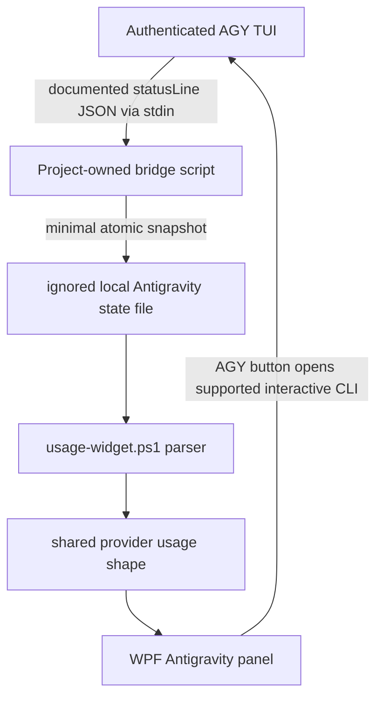

# Antigravity Live Quota Provider - Plan

## Goal Capsule

- **Objective:** Replace the Antigravity mock-only provider with live, per-model Google Antigravity quota data without extracting OAuth credentials or calling undocumented Google endpoints.
- **Authority:** The existing WPF tray widget, local Antigravity/AGY installation, and user-selected provider settings are in scope. Google internal APIs, stored Google OAuth tokens, account purchase flows, and changes to Antigravity itself are out of scope.
- **Execution profile:** Characterize the statusline payload from a verified AGY executable before accepting it as a stable source; this is a hard gate: do not implement the bridge/widget integration unless one sanitized real callback proves both quota windows and reset timestamps.
- **Stop conditions:** Do not ship a direct API client or a button advertised as a refresh if it cannot obtain a fresh value. If the installed CLI payload omits quota data, keep the provider disabled and surface a precise unsupported-version/configuration error.

---

## Product Contract

### Summary

Google AI Pro quota is refreshed approximately every five hours until its weekly limit is reached, and Antigravity displays quota separately for each model family. The widget should show AGY's active model/pool current-window and weekly usage, keeping authentication and Google service calls inside the official client.

### Problem Frame

`usage-widget.ps1` currently registers Antigravity as a two-window provider but `Invoke-AntigravityLiveFetch` only parses `antigravity-mock.json`. The existing `API` action therefore reads a mock file and can misleadingly look like a live refresh.

The installed `agy.exe` 1.1.1 exposes `models` but no scriptable `quota` or `usage` subcommand. Its logs show an internal quota refresh loop and private `daily-cloudcode-pa.googleapis.com/v1internal:*` calls. Those calls are neither public API nor safe to reproduce: the service terms forbid using Antigravity OAuth through third-party tools. AGY's documented custom statusline is the supported local integration point because it receives state JSON while the signed-in CLI runs.

### Requirements

**Live source and safety**

- R1. Treat AGY's statusline JSON callback as the only live source; the widget must not read Google OAuth credentials, invoke private Google endpoints, or persist account email, tokens, or raw statusline JSON.
- R2. Capture only allowlisted quota fields, provider/plan metadata, and capture time into a canonical `%LOCALAPPDATA%\CodexUsageMeter\antigravity-quota.json` snapshot that the widget can read while AGY is running.
- R3. Require a verified absolute AGY `.exe` path (the current machine's `agy.exe` is not on PATH), validate `--version`, and report a concrete configuration or compatibility failure when AGY, statusline configuration, authentication, or quota fields are unavailable.

**Quota presentation**

- R4. Represent the active model/pool with `Current session` and `Weekly` windows, including normalized `used_percent` and reset time; do not fabricate counts where AGY supplies only remaining percentages.
- R5. Preserve the newest good Antigravity snapshot when a bridge update or manual action fails, and visibly mark stale data according to the provider's configured staleness threshold.
- R6. In v1, display the active AGY model/pool only and make it explicit in the panel. Do not expose a model selector or aggregate the eight model rows shown in Antigravity's quota screen.

**Interaction and compatibility**

- R7. Replace the misleading `API` control with an `AGY` action that launches the validated `agy.exe` with a fixed empty argument array. It must state only that it opens Antigravity CLI and the widget updates through the running statusline bridge, not synchronously through an API call.
- R8. Keep the provider optional, preserve mock input solely as a test fixture, and leave existing Codex, MiniMax, and Grok behavior unchanged.
- R9. Document setup, capture behavior, data boundaries, and the exact recovery steps when the AGY protocol changes.

### Acceptance Examples

- AE1. Given AGY is authenticated and its bridge receives a payload for the active Claude pool with current and weekly quota percentages and reset times, when the widget refreshes, then Antigravity renders those two windows, identifies that active model/pool, and shows the capture timestamp.
- AE2. Given the bridge writes a malformed or partial snapshot after a valid one, when the widget refreshes, then it keeps the valid snapshot and marks the provider stale/error rather than replacing quota bars with zeros.
- AE3. Given AGY is absent or the installed version does not provide the required quota payload, when Antigravity is enabled, then the widget remains usable and its provider status identifies the missing executable, statusline bridge, or unsupported payload.
- AE4. Given the user clicks `AGY`, when the validated executable is found, then a bare CLI session opens without shell interpolation; the action status says fresh widget data arrives through the running statusline bridge, not through an API call.

### Scope Boundaries

- Do not reverse engineer `daily-cloudcode-pa.googleapis.com` requests or copy tokens from Windows Credential Manager, AGY, or Antigravity desktop storage.
- Do not install or vendor an unreviewed third-party statusline plugin. The bridge remains a small project-owned PowerShell script and is enabled only by explicit local configuration.
- Do not promise an exact token/request allowance. Antigravity's limits are work-based and subject to capacity changes.
- Defer a multi-model dashboard and automatic subscription/credit purchases. This increment displays one active model/pool, matching the widget's two-window provider contract.

---

## Planning Contract

### Key Technical Decisions

- KTD-1. **Use a statusline-to-snapshot bridge, not a direct API.** Official AGY documentation supports a command statusline that receives JSON over stdin whenever CLI state changes. This keeps sign-in and remote requests inside AGY, unlike the private endpoints visible in local logs. The bridge will emit a minimized atomic JSON snapshot into the ignored app-state area.
- KTD-2. **Model the result as percentages plus reset timestamps.** The bridge schema names source values `remaining_percent`; the parser clamps them to 0..100 and emits the shared renderer field `used_percent = 100 - remaining_percent`. The shared provider shape leaves `total` and `used` unset when unavailable.
- KTD-3. **Make the button an AGY launcher rather than a fake refresh.** `agy --help` has no quota/usage subcommand, so no supported one-shot CLI refresh exists. The action opens AGY's interactive Models & Quota flow; the bridge updates the snapshot when AGY emits its next statusline state.
- KTD-4. **Own the bridge configuration without silently replacing a user's statusline.** A documented project-owned setup script reads `~/.gemini/antigravity-cli/settings.json`, detects an existing `statusLine.command`, and only installs the bridge after an explicit local confirmation. A conflict is read-only and requires manual resolution; no command chaining is claimed until it has been characterized.
- KTD-6. **Harden the local file/command boundary.** The bridge allowlists fields in memory before it writes anything; uses a unique same-directory temporary file, flush/close, `File.Replace` for existing snapshots, and retrying reader logic. It rejects reparse points/non-regular files and reports redacted schema errors only. Setup and launch use a fixed vetted PowerShell executable/script path and `Start-Process -FilePath` with an argument array—never a shell command string.
- KTD-5. **Retain mock parsing as a fixture only.** Tests continue to feed deterministic statusline snapshot fixtures; normal runtime configuration no longer treats `antigravity-mock.json` as live input.

### Technical Design

The bridge parses stdin in memory and extracts only a schema-versioned object containing `captured_at`, AGY version, `plan_tier`, active model/pool identifier, `current.remaining_percent`, `current.resets_at`, `weekly.remaining_percent`, and `weekly.resets_at`. It drops unknown fields before any output, writes no raw input or exception objects, and creates the canonical LocalAppData snapshot under the current user's ACL. A unique temporary sibling is flushed/closed before `File.Replace` (or first-write move), so the widget retries transient IO/JSON failures and retains its last good snapshot.

`usage-widget.ps1` resolves Antigravity settings in the same configuration style as MiniMax and Grok: enabled flag, executable override, snapshot path, stale interval, and action timeout. Its parser validates the schema and date values, maps remaining percentage to shared `used_percent`, and returns the standard `primary`/`secondary` object without synthetic totals. A snapshot from another model is valid because v1 always displays the active AGY model, not a separately configured model.

### Research Anchors

- Google documents that AI Pro has generous quota refreshed every five hours until weekly limit and that baseline quota is visible in the settings page: [Antigravity plans](https://antigravity.google/docs/plans).
- Google documents the statusline command callback and its JSON state contract: [AGY custom status line](https://antigravity.google/docs/cli-statusline).
- The installed AGY 1.1.1 binary lists `models` but no `quota`/`usage` subcommand; its local CLI log contains `quotaRefreshLoop` and private `v1internal:fetchAvailableModels` requests.
- Google's terms expressly prohibit third-party tools from accessing Antigravity with Antigravity OAuth: [Antigravity terms](https://antigravity.google/terms).

### Sequencing

1. Characterize and lock the AGY payload contract, settings location/key, and bare-launch behavior with an in-memory allowlisting recorder and sanitized fixtures; stop if both windows/reset fields are absent.
2. Add the standalone bridge plus exactly one explicit setup script and conflict behavior.
3. Replace mock-only provider fetching with snapshot parsing, staleness handling, and AGY launcher action.
4. Add automated tests, update documentation, then run the widget smoke path with AGY both present and unavailable.

---

## Implementation Units

### U1. Characterize the AGY quota callback and define the local snapshot contract

- **Goal:** Verify which quota/reset fields AGY 1.1.1 emits for Google AI Pro and establish the smallest stable snapshot schema before product code depends on it.
- **Files:** `tools/capture-antigravity-statusline.ps1` (new, temporary diagnostic or retained fixture generator), `tests/fixtures/antigravity-statusline-pro.json` (new), `tests/fixtures/antigravity-statusline-missing-quota.json` (new), `docs/antigravity-statusline-contract.md` (new).
- **Patterns:** Follow the no-secret diagnostic boundaries used by Grok auth tests; parse stdin in memory, allowlist fields before every write, and redact all errors.
- **Test scenarios:** Record an authenticated callback; assert the fixture has only approved fields; prove synthetic token/email fields never reach output/log/temp files; verify that missing current or weekly quota becomes an explicit unsupported-payload outcome and blocks U2-U4; verify the active model/pool is distinguishable; record AGY's actual settings location/key and confirm the validated `.exe` opens without arguments.
- **Verification:** Compare the sanitized fixture to AGY's documented statusline fields and manually confirm it corresponds to the Antigravity Models & Quota screen.

### U2. Add opt-in AGY statusline bridge and configuration resolution

- **Goal:** Install or invoke a small local PowerShell bridge that atomically writes the minimized snapshot without replacing an existing user statusline command.
- **Files:** `tools/antigravity-statusline-bridge.ps1` (new), `tools/install-antigravity-statusline-bridge.ps1` (new), `usage-widget.ps1`, `usage-widget.local.example.json` (new), `tests/antigravity-bridge.Tests.ps1` (new), `tests/antigravity-settings.Tests.ps1` (new).
- **Patterns:** Follow `Get-GrokSettings` and `Get-ProviderConfigObject`; resolve `providers.antigravity` without erasing other settings, use `File.Replace`, and never log stdin/raw payload.
- **Test scenarios:** Valid payload becomes the exact minimized snapshot; invalid JSON leaves the prior snapshot untouched; reader retry retains a good snapshot across transient write failure; reparse-point/tampered-path and replace-between-read inputs are rejected; an existing `statusLine.command` produces a read-only conflict; the installer requires explicit confirmation before adding the documented fixed command; executable override must resolve to an existing canonical `.exe` and rejects `.cmd`, shell fragments, quotes, and PATH shadowing.
- **Verification:** Configure an isolated local AGY profile, launch AGY, and confirm the bridge file updates without displaying payload content or secrets.

### U3. Replace the mock-only provider with live snapshot parsing and truthful action behavior

- **Goal:** Convert the bridge snapshot into the shared provider contract, preserve old good data on errors, and change `API` to the AGY interactive launcher.
- **Files:** `usage-widget.ps1`, `usage-widget.config.json`, `tests/antigravity-provider.Tests.ps1` (new), `tests/antigravity-refresh.Tests.ps1` (new), `tests/provider-regression.Tests.ps1`.
- **Patterns:** Follow `Convert-GrokBillingApiResponse`, `Invoke-GrokRefreshCore`, and `Set-ProviderActionStatus`, but split the current Grok-specific API status/usage path in `Invoke-ProviderRefreshAction` into provider-specific action behavior; retain `antigravity-mock.json` only where tests need a fixture.
- **Test scenarios:** Map `remaining_percent` to clamped `used_percent`; parse ISO and Unix reset timestamps; reject malformed, stale, and schema-incompatible snapshots; preserve prior data on parse/launch failure; launch the validated AGY `.exe` only through `Start-Process -FilePath` and fixed arguments; redact token-like malformed input from UI/log errors; retain the two-window layout while all existing provider regression assertions pass.
- **Verification:** Enable Antigravity with a captured fixture, then with a live bridge snapshot; click `AGY`; confirm no HTTP client or credential lookup runs from the widget process.

### U4. Document user setup and operational failure modes

- **Goal:** Make the local, opt-in setup and its limits understandable without suggesting unsupported API access.
- **Files:** `README.md`, `usage-widget.local.example.json`, `docs/antigravity-statusline-contract.md`.
- **Patterns:** Match the Grok section's clear distinction between local logs and manual API behavior, but state that Antigravity's button launches AGY rather than performs an API request.
- **Test scenarios:** Documentation examples parse as JSON; every documented configuration key is read by `Get-AntigravitySettings`; recovery covers not installed, unauthenticated, stale snapshot, and statusline conflict.
- **Verification:** Follow README setup from a clean local config and confirm the provider has a visible unsupported/configuration state rather than a mock success.

---

## Verification Contract

| Gate | Applies to | Done signal |
| --- | --- | --- |
| PowerShell parse | U2-U3 | `usage-widget.ps1` parses without syntax errors. |
| Pester provider suite | U1-U3 | `Invoke-Pester -Path .\tests -EnableExit` passes, including new Antigravity fixtures and regression tests. |
| Secret scan | U1-U4 | No fixture, state file, log, or committed config contains OAuth access tokens, refresh tokens, email, or raw AGY payload. |
| Fixture smoke | U3 | Test-mode widget renders valid/stale/unsupported Antigravity states without affecting Codex, MiniMax, or Grok. |
| Live opt-in smoke | U2-U4 | A signed-in AGY session updates the minimized snapshot, and the widget displays the matching current and weekly percentages/reset times. |
| Launcher smoke | U3 | Clicking `AGY` opens the detected CLI and never sends a direct HTTP request from the widget. |

---

## Definition of Done

- The mock-only runtime path is replaced by a documented, opt-in, locally authenticated AGY statusline bridge.
- Antigravity shows AGY's active model/pool current and weekly percentage/reset data when the supported payload contains it.
- The widget never uses Google OAuth data or private Google endpoints, and no raw statusline payload is persisted or logged.
- `AGY` accurately launches the supported interactive inspection path; it is not labelled `API` or represented as a synchronous refresh.
- Existing providers retain their behavior; the full Pester suite and a hidden widget smoke launch pass.
- README and local configuration guidance describe setup, staleness, conflict handling, and recovery from upstream CLI protocol changes.
